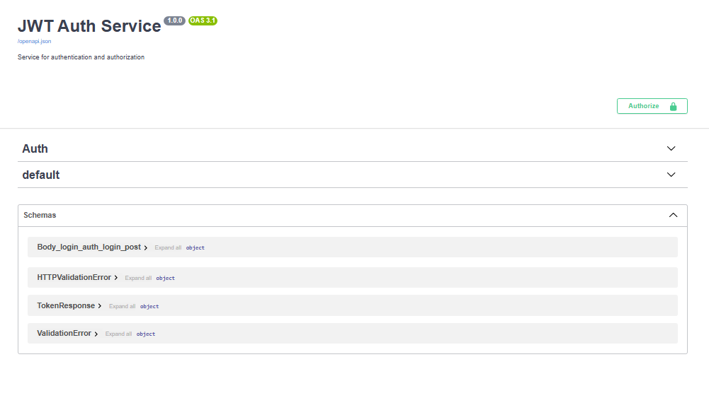
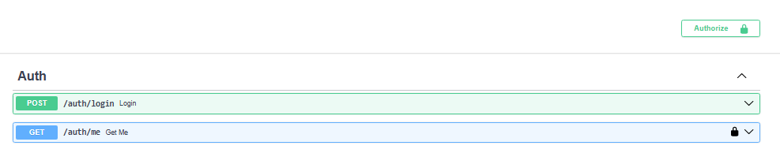

# JWT Auth Service

Servicio de autenticación y autorización basado en JWT utilizando FastAPI, OAuth2 y SQLAlchemy.

## Features

- JWT Authentication
- OAuth2 Password Flow
- Protected Routes
- Current Authenticated User
- Password Hashing con bcrypt
- Arquitectura modular
- Integración con Swagger UI
- Docker Support

## Tech Stack

- **FastAPI** — Framework web
- **SQLAlchemy** — ORM para MySQL
- **python-jose** — Generación y verificación de JWT
- **Passlib + bcrypt** — Hashing de contraseñas
- **Docker** — Contenedorización

## Estructura del Proyecto

```
jwt-auth-service/
├── app/
│   ├── core/
│   │   ├── database.py 
│   │   └── security.py 
│   ├── dependencies/
│   │   ├── auth.py           
│   │   └── database.py      
│   ├── models/
│   │   └── user.py          
│   ├── routers/
│   │   └── auth.py          
│   ├── schemas/
│   │   └── auth.py          
│   └── main.py              
├── .env.example                      
├── Dockerfile
├── docker-compose.yml
└── requirements.txt
```

## Endpoints

| Método | Ruta          | Descripción                      | Auth |
|--------|---------------|----------------------------------|------|
| GET    | `/`           | Health check                     | No   |
| POST   | `/auth/login` | Login con email y password        | No   |
| GET    | `/auth/me`    | Obtener datos del usuario actual  | Sí   |

## Variables de Entorno

| Variable                     | Descripción                          |
|------------------------------|--------------------------------------|
| `DATABASE_URL`               | URL de conexión a MySQL              |
| `SECRET_KEY`                 | Clave secreta para firmar tokens JWT |
| `ALGORITHM`                  | Algoritmo de firma (ej: HS256)       |
| `ACCESS_TOKEN_EXPIRE_MINUTES`| Tiempo de expiración del token       |

## Preview

### Swagger UI



### JWT Authentication



## Instalación

### 1. Configurar variables de entorno

```bash
cp .env.example .env
```

Edita el archivo `.env` con tus valores reales.

### 2. Con Docker

```bash
docker-compose up --build
```

La API estará disponible en `http://localhost:8001`.

### 2. Sin Docker

```bash
python -m venv venv
source venv/bin/activate  # Linux/Mac
venv\Scripts\activate     # Windows

pip install -r requirements.txt
uvicorn app.main:app --reload --port 8000
```

## Uso

### Login

```bash
curl -X POST http://localhost:8001/auth/login \
  -H "Content-Type: application/x-www-form-urlencoded" \
  -d "username=user@email.com&password=secret"
```

Respuesta:
```json
{
  "access_token": "eyJhbGciOi...",
  "token_type": "bearer"
}
```

### Obtener usuario actual

```bash
curl http://localhost:8001/auth/me \
  -H "Authorization: Bearer <token>"
```

Respuesta:
```json
{
  "id": 1,
  "username": "john",
  "email": "john@email.com"
}
```

## Documentación Interactiva

FastAPI genera documentación automática:

- **Swagger UI:** `http://localhost:8001/docs`
- **ReDoc:** `http://localhost:8001/redoc`
